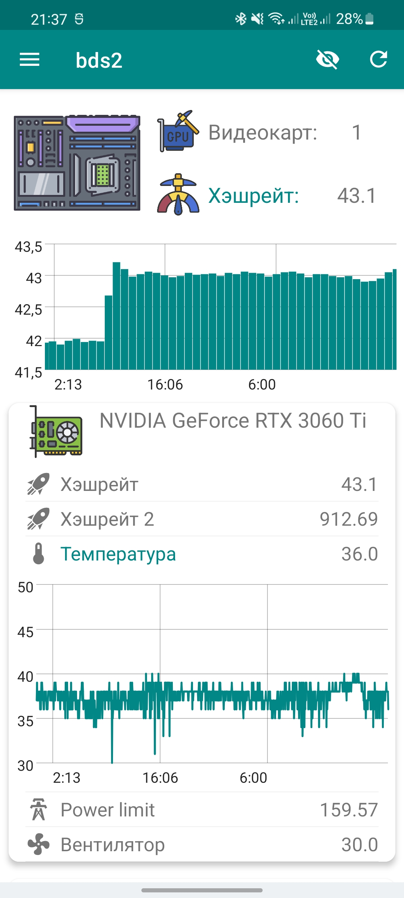

# Miner2Android

Cбор информации с ваших майнинг ферм.

  

 

## Изменения

<details>
  <summary>1.1</summary>

- Уведомления (каждые 15 минут приложение проверяет наличие уведомлений на вашей ферме)
</details>
<details>
  <summary>1.2</summary>

- Графики изменения величин, с момента начала предыдущих суток (необходимо обновление [miner2mqtt](https://github.com/bds89/miner2mqtt))

<details>
  <summary>1.2.1</summary>

- Добавлена некоторая анимация
</details>
<details>
  <summary>1.2.2</summary>

- Сохранение теперь происходит в базу данных, вместо отдельных файлов. К сожалению вам придется заново добавить все свои компьютеры и их настройки, потому что мне лень было писать адаптер для переноса настроек.
- Исправления
</details>
</details>


## Описание

**Поддерживаемые ОС (backend части)**

- Linux
- Windows (без управления)

**Поддерживаемые майнеры**

- T-Rex
- danila miner
- lol miner

**Возможности:**

- Сбор информации от майнера о состоянии видеокарты и ее производительности
- Изменение скорости вениляторов и power limit видеокарты (только для Linux)

**Примечания:**

- Для работы приложения необходимо установить на вашу ферму [miner2mqtt](https://github.com/bds89/miner2mqtt)
  
## Пример config.yaml в [miner2mqtt](https://github.com/bds89/miner2mqtt), при использовании приложения:
```yaml
MINER: Trex/danila-miner/lol-miner
    #выбор GPU майнера (не обязательно)
danila_command: "/home/ferma2/TON_miner/danila-miner run https://server1.whalestonpool.com your_walet_adress"
    #Команда для запуска danila-miner(*обязательно, если используется `danila-miner`)
lol_command: /home/bds89/lolMiner_v1.44_Lin64/1.44/dual_mine_eth_ton.sh
    #Команда для запуска lol-miner(не обязательно, при запуске майнера скриптом m2m в mqtt будет передаваться дополнитльный параметр `lhrtune`)
TrexAPI: http://127.0.0.1:4067
    #адрес API для Trex майнера, если отличается от стандартного
TrexAPIPASS: YourWebGuiPassword
    #ваш пароль для Trex майнера
lolAPI: http://127.0.0.1:4067
    #адрес API для lol майнера (обязательно если ипользуется `lol-miner`)
SUDO_PASS: pass
    #пароль суперпользователя, для изменения power_limit, только для Linux
INTERVAL: 120s
    #интервал сбора информации в секундах (*обязательно), интервал нужен для вычисления средних покаателей хэшрейта за час.
INCLUDE: {}
EXCLUDE: {}
    #фильтры по ключам из JSON словаря вашего майнера (поддерживаются только ключи первого уровня)
APP: #(не обязательно, если используете только для публикации в MQTT, этот блок можно убрать)
  IP_FLASK: 192.168.0.101 #IP вашего компьютера в локальной сети, обязательно для Windows, для Linux скрипт попытается найти самостоятельно 
  PORT_FLASK: 5000 #(не обязательно)
  SLAVE_PC: false #(не обязательно, если данный компьютер будет подключаться к мобильному приложению чере другой компьютер, укажите `true`)
  SESSIONKEY: "1111" #любой набор символов(не обязательно, при отсутствии будет использоваться литерал из кода)
  PASS: "mobileAppPass" #пароль для подключения мобильного приложения (*не обязательно)
```

## Планы
- Добавление мониторинга фермы с Chia (возможно будет отдельный проект)
